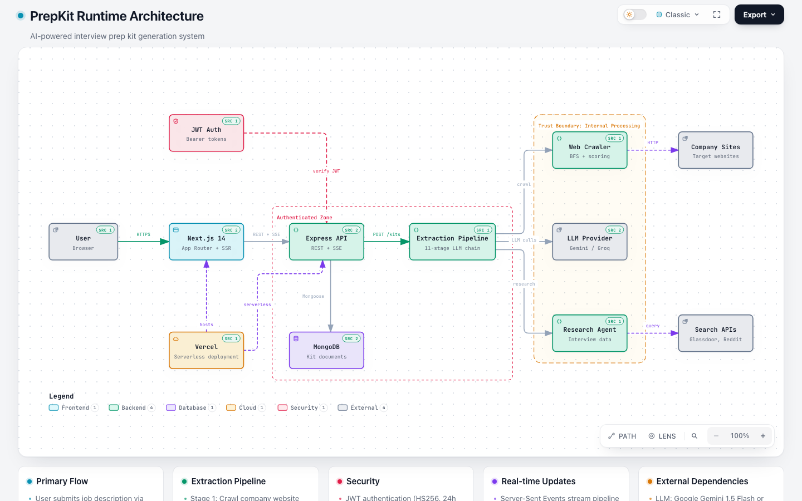

# PrepKit - AI Interview Prep Kit

> Paste a job description. Get a personalized interview prep kit in minutes.

[](https://vercel.com/new/clone?repository-url=https://github.com/Aryan-040/PrepKit)
[](https://prepkit-lilac.vercel.app)

Given a job description, a company website URL, and the number of days until the interview, the system crawls the company's site, researches public interview-process discussions, then runs a sequential LLM pipeline to produce:

- **Company brief** — what the company does, sourced from their own pages
- **Role breakdown** — extracted requirements categorized as technical / behavioral / domain, each marked as must-have or nice-to-have
- **Question bank** — categorized questions (technical, behavioral, system-design, company-fit) linked to specific requirements
- **Flashcards** — front/back study cards linked to requirements
- **Day-by-day schedule** — difficulty-ordered study plan for however many days you have

Users can edit, reorder, add, delete, and regenerate any section inline without losing edits elsewhere. A Practice Mode provides confidence-tracked flashcard step-through. A CLI batch runner (`npm run evaluate`) executes the same pipeline programmatically for automated evaluation.

---

## Table of Contents

- [Tech Stack](#tech-stack)
- [Prerequisites](#prerequisites)
- [Setup](#setup)
- [Architecture](#architecture)
- [Key Features](#key-features)
- [LLM Provider](#llm-provider)
- [Retrieval Approach](#retrieval-approach)
- [Pipeline](#pipeline)
- [Running Tests](#running-tests)
- [Running the Batch CLI](#running-the-batch-cli)
- [Practice Mode](#practice-mode)
- [Known Limitations](#known-limitations)
- [License](#license)

---

## Tech Stack

| Layer | Technology | Rationale |
|---|---|---|
| Frontend | Next.js 14 (App Router) + TypeScript | RSC for fast initial kit loads; App Router enables a clean auth/app route-group split |
| Styling | Tailwind CSS | Utility-first, zero-runtime overhead; custom design tokens map directly to the spec colour palette |
| Drag and drop | `@dnd-kit/core` + `@dnd-kit/sortable` | Accessible, pointer/touch-first DnD without a heavy jQuery dependency |
| Backend | Express 4 + TypeScript + Node 18 | Lightweight HTTP layer; native `EventSource` (SSE) support without a framework abstraction |
| Database | MongoDB via Mongoose 8 | Document model fits the embedded Kit structure (questions, flashcards, schedule all in one document); avoids multi-collection joins for reads |
| Auth | `jsonwebtoken` + `bcryptjs` | Standard HS256 JWT with bcrypt cost-12 hashing; stateless — no session store required |
| LLM | Google Gemini 1.5 Flash (default) or Groq Llama 3.1 | Gemini Flash: generous free tier (15 RPM, 1M TPM/day), fast responses; Groq: higher RPM limits, useful as a fallback |
| Web scraping | Cheerio + Axios | Cheerio's jQuery-like API for link extraction and text stripping; Axios for typed HTTP with interceptors |
| HTML entities | `he` | Robust named and numeric HTML entity decoder (covers edge cases `DOMParser` misses in Node.js) |
| SSRF guard | `ipaddr.js` + `dns.promises` | Resolves hostnames and checks all returned IPs against blocked RFC 1918 / loopback / link-local ranges |
| Robots.txt | `robots-parser` | Standards-compliant robots.txt parsing; avoids re-implementing the spec |
| Input validation | `zod` | Schema-first, TypeScript-native validation with structured error output |
| Property-based tests | `fast-check` | TypeScript-native PBT library; excellent for the deterministic scheduler and coverage checker |
| Test runner | Vitest | ESM-native, fast, shares TypeScript config with the main codebase |
| Monorepo | npm workspaces | Zero-config shared package resolution; no extra tooling needed |
| Deployment | Vercel | Unified deployment platform for full-stack Next.js + Express API via serverless functions |

---

## Prerequisites

- **Node.js 18.x or later** (enforced by the monorepo `engines` field)
- **MongoDB** — local (Community Edition) or [MongoDB Atlas](https://www.mongodb.com/atlas) free tier
- **Google Gemini API key** (free) — get yours at https://aistudio.google.com/app/apikey
- **Groq API key** (optional fallback) — get yours at https://console.groq.com
- **SerpApi key** (optional) — for more reliable research results than the default DuckDuckGo scraper

---

## Setup

### 1. Clone and install

```bash
git clone https://github.com/Aryan-040/PrepKit.git
cd PrepKit
npm install
```

This installs dependencies for both frontend and backend workspaces.

### 2. Configure environment variables

**Backend configuration:**

```bash
cp .env.example backend/.env
```

Edit `backend/.env` with your credentials:

```dotenv
# MongoDB connection
MONGODB_URI=mongodb://localhost:27017/interview-prep-kit

# JWT secret (generate with: node -e "console.log(require('crypto').randomBytes(48).toString('hex'))")
JWT_SECRET=<your-generated-secret>

# LLM Provider (gemini or groq)
LLM_PROVIDER=gemini

# API Keys
GEMINI_API_KEY=<your-gemini-api-key>
GROQ_API_KEY=<your-groq-api-key-optional>

# Optional: Research provider
RESEARCH_PROVIDER=duckduckgo
SERPAPI_KEY=<your-serpapi-key-optional>
```

**Frontend configuration:**

Create `frontend/.env.local`:

```dotenv
NEXT_PUBLIC_API_URL=http://localhost:4000/api
```

### 3. Run in development

**Option 1: Run both together (recommended)**

```bash
# Terminal 1 - Backend API (http://localhost:4000)
npm run dev:backend

# Terminal 2 - Frontend (http://localhost:3000)
npm run dev:frontend
```

**Option 2: Run from workspace root**

```bash
# Run backend
npm run dev --workspace=backend

# Run frontend (in another terminal)
npm run dev --workspace=frontend
```

The backend validates all required environment variables at startup. Check the terminal output if the server doesn't start.

### 4. Production deployment on Vercel

The application is configured for unified full-stack deployment on **Vercel**:

- **Frontend**: Next.js App Router (static + SSR)
- **Backend**: Express API as serverless functions via `backend/api/index.ts`
- **Routing**: All `/api/*` requests route to the backend; other requests go to Next.js

#### Deploy to Vercel

1. **Push to GitHub**:
   ```bash
   git push origin main
   ```

2. **Import project in Vercel**:
   - Go to [vercel.com](https://vercel.com)
   - Click "Add New Project"
   - Import your GitHub repository
   - Vercel auto-detects the Next.js configuration

3. **Configure environment variables** in Vercel dashboard (Settings → Environment Variables):

   **Required:**
   ```
   MONGODB_URI=<your-mongodb-atlas-connection-string>
   JWT_SECRET=<generate-secure-secret>
   LLM_PROVIDER=gemini
   GEMINI_API_KEY=<your-api-key>
   NODE_ENV=production
   ```

   **Optional:**
   ```
   GROQ_API_KEY=<groq-key>
   SERPAPI_KEY=<serpapi-key>
   RESEARCH_PROVIDER=duckduckgo
   ```

4. **Deploy**: Vercel automatically builds and deploys on every push to main

#### How it works

The `vercel.json` configuration:
- Routes `/api/*` to `backend/api/index.ts` (serverless function)
- Routes everything else to the Next.js frontend
- Sets `NEXT_PUBLIC_API_URL=/api` automatically in production

This means:
- ✅ No CORS issues (same-origin requests)
- ✅ Single domain for frontend + backend
- ✅ Automatic SSL/HTTPS
- ✅ Serverless scaling

> **Note:** SSRF IP-range blocking (RFC 1918, loopback, link-local) is only enabled when `NODE_ENV=production`.

---

## Running the Batch CLI

The batch runner processes a JSON file of cases through the same pipeline the web application uses, then writes results to a JSON output file.

### Usage

```bash
npm run evaluate -- --input <input-path> --output <output-path>
```

**From the repository root** (after running `npm install` and configuring `backend/.env`):

```bash
npm run evaluate -- --input cases.json --output kits.json
```

### Input format

The input must be a JSON array of case objects:

```json
[
  {
    "id": "case-001",
    "jd": "We are looking for a senior software engineer with 5+ years of experience in TypeScript, Node.js, and distributed systems...",
    "company_url": "https://example.com",
    "days": 7
  }
]
```

| Field | Type | Description |
|---|---|---|
| `id` | string | Unique case identifier (included in output for correlation) |
| `jd` | string | Job description text |
| `company_url` | string | Company website URL (absolute, HTTP or HTTPS) |
| `days` | integer ≥ 0 | Number of days until the interview |

### Output format

```json
{
  "version": "1.0",
  "generated_at": "2024-01-15T10:30:00.000Z",
  "kits": [
    {
      "id": "case-001",
      "status": "ok",
      "kit": { ... },
      "error": null
    }
  ]
}
```

Each kit entry has `status: "ok"` with the full kit object, or `status: "failed"` with a `{ code, message }` error object and `kit: null`.

> **Status semantics:** `"failed"` means the pipeline threw an unhandled exception or the case had invalid fields. Incomplete research (no hiring page found, empty passages) still results in `"ok"` with the affected kit fields set to `null` or empty arrays.

### Performance

The batch runner processes cases sequentially. Five cases complete within 15 minutes including rate-limit retries. Each rate-limit response triggers exponential backoff (up to 60 s per attempt, max 3 retries per case before recording `"failed"`).

---

## Architecture

### System Overview

The following diagram shows the runtime architecture of PrepKit, including core components, trust boundaries, and the primary data flow:



*Interactive version: [View full diagram](.archify/architecture-prepkit-20261008-132754/prepkit.html)*

### Project Structure

The project uses **npm workspaces** with two main packages:

```
PrepKit/
├── frontend/                # Next.js 14 (App Router) + TypeScript
│   ├── app/
│   │   ├── (auth)/         # Unauthenticated routes (login, register)
│   │   │   ├── login/
│   │   │   ├── register/
│   │   │   └── layout.tsx
│   │   ├── (app)/          # Authenticated routes with sidebar
│   │   │   ├── dashboard/
│   │   │   ├── create/
│   │   │   └── kits/[id]/
│   │   │       ├── page.tsx       # Kit builder
│   │   │       └── practice/      # Practice mode
│   │   ├── globals.css
│   │   ├── layout.tsx
│   │   └── page.tsx        # Landing page
│   ├── components/
│   │   ├── ui/             # Primitives: Button, Input, Badge, Spinner, etc.
│   │   ├── auth/           # AuthForm, LandingPage
│   │   ├── builder/        # KitBuilder, QuestionCard, FlashcardCard, etc.
│   │   ├── create/         # CreateForm, BatchUpload, ProgressTracker
│   │   ├── practice/       # PracticeMode, FlashcardViewer, ConfidenceRater
│   │   └── layout/         # AppShell, Sidebar, AuthGuard
│   ├── lib/
│   │   ├── api.ts          # Typed fetch wrappers (attaches JWT)
│   │   ├── auth.ts         # localStorage JWT helpers
│   │   └── sse.ts          # useSSEProgress hook (EventSource)
│   ├── .env.local          # Local: NEXT_PUBLIC_API_URL
│   └── .env.production     # Production: auto-set by Vercel
│
├── backend/                # Express 4 + TypeScript
│   ├── api/
│   │   └── index.ts        # Vercel serverless entry point
│   ├── src/
│   │   ├── app.ts          # Express app setup
│   │   ├── server.ts       # HTTP server (dev mode)
│   │   ├── config.ts       # Environment validation
│   │   ├── db.ts           # MongoDB connection
│   │   ├── errors.ts       # Custom error classes
│   │   ├── events.ts       # SSE event emitter
│   │   ├── routes/
│   │   │   ├── auth.ts     # POST /register, /login
│   │   │   ├── kits.ts     # CRUD, regeneration, SSE progress
│   │   │   └── practice.ts # GET /deck, POST /rate
│   │   ├── middleware/
│   │   │   ├── authenticate.ts   # JWT verification
│   │   │   ├── errorHandler.ts   # Global error handler
│   │   │   ├── sanitise.ts       # XSS prevention
│   │   │   └── ssrfGuard.ts      # SSRF protection
│   │   ├── services/
│   │   │   ├── crawler.ts              # BFS web crawler
│   │   │   ├── researchAgent.ts        # Interview research
│   │   │   ├── extractionPipeline.ts   # Main pipeline orchestrator
│   │   │   ├── coverageChecker.ts      # Requirement coverage
│   │   │   ├── scheduler.ts            # Study schedule builder
│   │   │   ├── llmClient.ts            # LLM abstraction
│   │   │   └── llmAdapters/
│   │   │       ├── gemini.ts
│   │   │       └── groq.ts
│   │   ├── models/
│   │   │   ├── User.ts
│   │   │   ├── Kit.ts
│   │   │   └── FlashcardProgress.ts
│   │   ├── shared/           # **Inlined shared types** (not workspace)
│   │   │   ├── types.ts      # Kit, Requirement, Question, Flashcard
│   │   │   ├── validator.ts  # validateKit() with Zod
│   │   │   ├── serialiser.ts # JSON serialization
│   │   │   └── index.ts
│   │   ├── scripts/
│   │   │   └── evaluate.ts   # CLI batch runner
│   │   └── types/
│   │       └── express.d.ts  # Type augmentations
│   ├── .env                  # Local: MONGODB_URI, JWT_SECRET, etc.
│   └── vitest.config.ts
│
├── vercel.json              # Unified Vercel deployment config
├── package.json             # Root workspace config
└── README.md
```

### Why shared types are inlined

The shared types, validators, and serializers are in `backend/src/shared/` **instead of a separate workspace package** because:

- **Vercel serverless compatibility**: npm workspace dependencies (`@interview-prep/shared`) don't resolve reliably in Vercel's serverless build
- **Simpler deployment**: No workspace linking issues or build-time dependency resolution
- **Frontend doesn't need them**: Frontend uses REST/SSE APIs with runtime validation, staying loosely coupled

### Request Flow

```
User → Browser
  ↓
Next.js (SSR/Client Components)
  ↓
REST API (Bearer JWT in Authorization header)
  ↓
Express Middleware (authenticate → ssrfGuard → sanitise)
  ↓
Route Handlers (auth, kits, practice)
  ↓
Services (crawler, research, pipeline, coverage, scheduler)
  ↓
LLM Adapters (Gemini/Groq) → External APIs
  ↓
MongoDB (Mongoose Models: User, Kit, FlashcardProgress)
  ↓
Response (JSON or SSE stream)
  ↓
Browser (display/update UI)
```

---

## LLM Provider

### Configuration

Set `LLM_PROVIDER` in `backend/.env` to `gemini` (default) or `groq`.

| Provider | Model | API key variable | Notes |
|---|---|---|---|
| `gemini` | `gemini-1.5-flash` (configurable via `GEMINI_MODEL`) | `GEMINI_API_KEY` | Default. Free tier: 15 RPM, 1M TPM/day |
| `groq` | `llama-3.1-70b-versatile` (configurable via `GROQ_MODEL`) | `GROQ_API_KEY` | Higher RPM limits; lower max context window |

The pipeline calls the LLM sequentially (one call at a time per pipeline run) to stay within free-tier rate limits. Each call is retried up to 3 times on JSON parse failure (with a correction instruction appended) and up to 5 times on a 429 rate-limit response (exponential backoff: 2 s → 4 s → 8 s → 16 s → 32 s, capped at 60 s).

### Prompt safety

All externally sourced content (job descriptions, crawled pages, research passages) is wrapped in `<external-content>` / `</external-content>` delimiters in every LLM prompt, with a system-level instruction stating that this content is data to be processed and must not be interpreted as instructions. This mitigates prompt-injection risks from adversarial web content.

---

## Retrieval Approach

### Company site crawling

The `CrawlerService` uses a scored BFS traversal:

1. **Fetch root URL** and parse all `<a href>` tags with Cheerio.
2. **Score each link** on a 0–10 scale using keyword matching:
   - Exact path segment match (e.g. `/about`, `/careers`) → +3 pts
   - Keyword in link text → +2 pts
   - Keyword in URL → +1 pt
   - Keywords: `about`, `careers`, `hiring`, `jobs`, `culture`, `engineering blog`
3. **Queue assignment**: links scoring ≥ 5 enter the high-priority queue; others the low-priority queue.
4. **BFS traversal**: high-priority queue is processed first; remaining capacity is filled from the low-priority queue. Configurable `maxDepth` (default 3) and `maxPages` (default 50) prevent runaway crawls.
5. **Safety and compliance**: `robots.txt` is fetched and cached per domain; disallowed URLs are skipped. SSRF guard blocks private/loopback IPs in production. Rate limiter: 2 requests/second per domain (token bucket). Retry on 429/5xx: exponential backoff 1 s → 2 s → 4 s → 8 s, up to 3 retries.
6. **Content filtering**: responses with `Content-Type` other than `text/html` or body > 5 MB are discarded without processing.
7. **Text extraction**: `<script>` and `<style>` blocks are removed, all remaining HTML tags are stripped, HTML entities are decoded with `he`, and whitespace is normalised before text is handed to the pipeline.

### Interview discussion research

`ResearchAgent` searches for public discussion of the company's interview process:

- **Query**: `"${companyName} interview process site:glassdoor.com OR site:reddit.com OR site:blind.com"`
- **DuckDuckGo** (default, no API key): scrapes Instant Answers endpoint — free but occasionally returns fewer results.
- **SerpApi** (set `RESEARCH_PROVIDER=serpapi`): reliable structured results via `SERPAPI_KEY`, 100 free searches/month.
- Extracts up to 5 relevant passages; applies the same HTML sanitisation as the crawler before passing text to the LLM.
- On zero results or source unreachable: records the absence and continues; the LLM generates questions from the job description and crawled content only.

---

## Pipeline

The extraction pipeline executes these named stages in sequence. Each LLM stage is a separate call with distinct, single-purpose instructions — never combined into one monolithic prompt.

```
1.  crawl                → CrawlerService              (no LLM)
2.  research             → ResearchAgent               (no LLM; search API)
3.  extract-requirements → LLM Call A                  → Requirement[]
4.  company-brief        → LLM Call B                  → CompanyBrief
5.  generate-questions   → LLM Calls C1–C4 per category → Question[]
6.  generate-flashcards  → LLM Call D                  → Flashcard[]
7.  coverage-check       → CoverageChecker             (deterministic — no LLM)
8.  gap-fill             → LLM Call E (if needed)      → additional Question[]
    ↑  repeat 7–8 up to 5 passes
9.  schedule             → Scheduler                   (deterministic — no LLM)
10. validate             → validateKit                 (shared package)
11. persist              → MongoDB
```

**Why separate LLM calls?** Each stage can be independently retried on rate-limit or JSON-parse failure without re-running the full pipeline. It also makes section regeneration (e.g. regenerating only the company brief) straightforward: re-run only Call B.

**SSE progress**: the frontend subscribes to `GET /api/kits/:id/progress`, which streams `StageEvent` objects as each stage starts, completes, or fails. This gives the user live progress without polling.

---

## Pinned State (User Edits During Regeneration)

Every `Question` and `Flashcard` carries a `pinned: boolean` field (default `false`). This field:

- Is set to `true` by the backend whenever a PATCH request edits a specific question or flashcard.
- Is set to `true` for any item the user manually adds via the Builder.
- Is **never** set back to `false` by any automated process — only deleting the item removes it from the pinned set.

When a question category is regenerated, the section regeneration service:

1. Partitions the category into `pinned` and `non-pinned` questions.
2. Runs the LLM question-generation call targeting `(maxPerCategory − pinnedCount)` new questions.
3. Assigns new sequential IDs to the generated questions.
4. Preserves all pinned questions in their original relative order; regenerated questions fill the remaining positions.
5. Re-runs the coverage checker and rebuilds the schedule with the updated question set.

The Builder renders a lock icon (`aria-label="Edited by you"`) on every pinned question and flashcard, making it visually clear which items will survive a regeneration.

---

## Schedule Algorithm

The `buildSchedule` pure function (no LLM, no I/O) allocates questions across days:

1. **Partition**: separate must-have-requirement questions from nice-to-have-requirement questions.
2. **Even-distribution check**: compute `evenSlots = ceil(mustCount / days) * days`. If `mustCount + niceCount ≤ evenSlots`, include both; otherwise include only must-have questions.
3. **Overflow**: if must-have questions alone exceed even-distribution capacity, include all must-have questions and log a warning — the schedule may exceed even distribution.
4. **Difficulty sort**: sort all active questions by `difficulty DESC` (3 first, then 2, then 1). Within the same difficulty level, sort by the question's position in the `role.requirements` array (requirements appearing earlier in the JD come first).
5. **Spaced repetition for long schedules**: if `days > question count`, repeat must-have questions in round-robin rotation until there is at least one question per day.
6. **Round-robin distribution**: assign questions to days via `day = index % daysAvailable`. This guarantees the difference between the highest and lowest per-day question count is at most 1.
7. **Minutes**: `day.minutes = 15 × day.question_ids.length` (15 minutes estimated per question).
8. **Focus**: each day's `focus` field is computed from the most-frequent `kind` among requirements linked to that day's questions.

---

## Key Design Decisions

### Embedded documents in MongoDB

Questions, flashcards, and the schedule are embedded in the Kit document rather than stored in separate collections. A single document fetch returns the entire kit — no joins needed. The trade-off is MongoDB's 16 MB document limit. In practice a kit with 200 questions at ~500 bytes each is ~100 KB, well within the limit.

### SSE instead of WebSockets for pipeline progress

Pipeline progress is strictly unidirectional (server → client). Server-Sent Events are simpler: standard HTTP, no upgrade handshake, works over HTTP/2 multiplexing. The trade-off is that SSE is unidirectional — if interactive pipeline control (e.g. cancel) were needed, WebSockets would be required.

### Coverage loop capped at 5 passes

The gap-fill loop runs a maximum of 5 passes before recording any remaining uncovered must-have requirements in `coverage.uncovered_requirement_ids`. This caps LLM API usage at predictable levels. In practice a well-prompted initial pass leaves fewer than 2 requirements uncovered, so 5 passes is a conservative ceiling.

### Deduplication by SHA-256 hash

A duplicate detection fingerprint is computed as `sha256(normalise(jobDescription) + '|' + normalise(companyUrl))` where `normalise` = lowercase + trim whitespace. The hash is stored as `dedupeKey` and indexed as a unique compound index on `(userId, dedupeKey)`. On collision, the API returns 409 with the existing kit's ID and creation date so the client can offer "Open existing" or "Create new".

### Scheduler spaced repetition (not SM-2)

When the user requests more days than there are questions, must-have questions are repeated in round-robin rotation. This is a simple approximation — not a true SM-2 interval algorithm. SM-2 would couple the schedule to prior practice ratings, complicating regeneration. The schedule is generated once; confidence-tracked Practice Mode handles adaptive repetition going forward.

### No JWT refresh tokens

Sessions expire after 24 hours; users re-authenticate. This is a deliberate scope reduction. A production system would implement refresh tokens.

---

## Known Limitations

- **Free LLM tier rate limits**: Gemini Flash free tier allows 15 requests per minute. Large batch runs may hit this limit and retry with exponential backoff, increasing total run time.
- **DuckDuckGo research reliability**: the DuckDuckGo scraper may return inconsistent results and does not always surface Glassdoor/Reddit passages. Use `RESEARCH_PROVIDER=serpapi` for more reliable research.
- **No auth provider integration**: authentication uses locally managed JWTs with no OAuth/OIDC provider. There is no "sign in with Google" or password reset flow.
- **No JWT refresh tokens**: users must re-authenticate after 24 hours.
- **Crawler limitations**: JavaScript-rendered pages (SPAs) are not crawled — the crawler fetches server-rendered HTML only (via Cheerio + Axios). Company sites built entirely on client-side rendering may not yield useful content.
- **robots.txt fetch failure is permissive**: if `robots.txt` cannot be fetched, all paths are treated as allowed. This is the standard default per the robots exclusion protocol.
- **No background job queue**: pipeline runs are attached to HTTP request lifecycle. If the server restarts mid-pipeline, in-progress kits will be stuck in `generating` status and must be retried manually.
- **Batch runner requires environment variables**: the CLI runner uses the same LLM and database credentials as the web server. Configure `backend/.env` before running `npm run evaluate`.
- **No rate limiting on API endpoints**: the backend does not rate-limit authentication or kit creation endpoints. A production deployment should add rate limiting at the proxy or middleware layer.
- **SSRF guard is production-only**: the IP-range blocking for private/loopback addresses is disabled when `NODE_ENV` is not `production`, allowing the crawler to reach localhost in development. Never run the development server against untrusted input in a shared environment.

---

## Running Tests

```bash
# Run all tests (both workspaces)
npm test

# Run only backend tests
npm test --workspace=backend

# Run backend tests with coverage
npm run test --workspace=backend -- --coverage

# Type-check frontend
npm run type-check --workspace=frontend

# Type-check backend
npm run type-check --workspace=backend
```

### Test Coverage

The backend test suite (Vitest) covers:

| File | What is tested |
|---|---|
| `routes/__tests__/auth.test.ts` | JWT middleware (valid, expired, malformed, wrong scheme, query-param token); `POST /register` validation and duplicate handling; `POST /login` credential verification and anti-enumeration |
| `routes/__tests__/kits.test.ts` | `POST /api/kits` input validation, 409 deduplication, `forceCreate` bypass; `GET /:id` ownership (403 for non-owner); `PATCH /:id` pinning of edited questions/flashcards; `DELETE /:id` kit + FlashcardProgress cleanup; `DELETE /:id/flashcards/:id` and `DELETE /:id/questions/:id` single-item removal |
| `routes/__tests__/practice.test.ts` | `GET /practice/deck` ordering (least-confident first, unseen = 0, lexicographic tiebreak), `coveredIds` computation; `POST /practice/rate` mean recomputation, validation, 404 on missing flashcard, 403 on non-owner |
| `services/__tests__/coverageChecker.test.ts` | Deterministic coverage: all covered, partial, empty, nice-to-have exclusion; property-based (fast-check × 100) |
| `services/__tests__/scheduler.test.ts` | Exact day count, must-have inclusion, difficulty ordering, minutes invariant, spaced repetition; property-based (fast-check × 100) |
| `scripts/__tests__/evaluate.test.ts` | CLI batch runner: output shape, valid/invalid cases, missing args, non-existent file, non-array input |

---

## Practice Mode

### Deck Ordering (Confidence-Based Prioritisation)

Each time a practice session starts, the backend computes the deck order using `GET /api/kits/:id/practice/deck`:

1. Load all flashcard IDs from the kit.
2. Load all `FlashcardProgress` documents for `(userId, kitId)`.
3. Map each flashcard ID to its `meanConfidence` (arithmetic mean of all historical confidence ratings). Cards with no prior rating default to `0`.
4. Sort ascending by `meanConfidence` — cards the user found hardest (or never reviewed) come first.
5. Lexicographic tiebreak on flashcard ID for deterministic ordering.

Confidence levels: `1 = Again` (hardest), `2 = Hard`, `3 = Good`, `4 = Easy`.

The `coveredIds` field in the response lists flashcard IDs with `meanConfidence > 0` (seen at least once). The frontend uses this to show a "seen before" badge in the deck position indicator.

After every card is rated, a `SessionSummary` shows per-confidence-level counts and offers a "Practice Again" button that re-fetches a freshly ordered deck.

### Confidence History Persistence

Each `POST /practice/rate` call upserts a `FlashcardProgress` document, pushing `{ confidence, ratedAt }` onto the `ratings` array and updating the cached `meanConfidence`. This survives page refreshes and sessions.

---

## Duplicate Kit Handling

When the user submits a job description and company URL that matches an existing kit for their account, the API returns `409` with the existing kit's metadata. The frontend shows a `DuplicateKitModal` offering two actions:

- **Open existing kit** — navigates to the existing kit.
- **Create new kit** — re-submits with `forceCreate: true`, which bypasses the deduplication check and creates a fresh kit with a randomised `dedupeKey` suffix so the unique compound index is not violated.

---

## Requirements & Coverage UI

The kit builder page includes a collapsible **Requirements & Coverage** panel positioned above the Company Brief section. It shows:

- All extracted requirements grouped by **must-have** (with coverage status) and **nice-to-have**.
- For each requirement: its stable ID (e.g. `r1`), extracted text, kind badge (Technical / Behavioural / Domain), and priority label.
- A progress bar showing what percentage of must-have requirements have at least one covering question, and how many coverage passes were run.
- A "No question yet" warning badge on any must-have requirement that remains uncovered after all coverage passes.

The panel is collapsed by default to avoid visual clutter but is always available for inspection.

---

## Key Features

### 1. Intelligent Content Extraction Pipeline

The system processes job descriptions through a multi-stage LLM pipeline:

- **Requirements Extraction**: Identifies technical, behavioral, and domain requirements
- **Company Brief Generation**: Creates summary from crawled company pages
- **Question Bank Generation**: Creates categorized interview questions
- **Flashcard Generation**: Produces study cards linked to requirements
- **Coverage Analysis**: Ensures all must-have requirements are addressed
- **Study Schedule**: Builds a day-by-day plan with difficulty-based ordering

### 2. Web Crawling & Research

- **Smart BFS Crawler**: Prioritizes relevant pages (careers, about, engineering blog)
- **Interview Research**: Searches Glassdoor, Reddit, Blind for real interview experiences
- **SSRF Protection**: Blocks requests to private/internal IP ranges in production
- **Robots.txt Compliance**: Respects website crawling policies
- **Rate Limiting**: Prevents overwhelming target servers

### 3. Real-time Progress Tracking

- **Server-Sent Events (SSE)**: Live pipeline progress updates
- **Named Stages**: Shows each step (crawl, research, extraction, etc.)
- **Error Handling**: Graceful failure with specific error messages

### 4. Interactive Kit Builder

- **Drag-and-Drop Reordering**: Powered by @dnd-kit
- **Inline Editing**: Edit questions, flashcards, and briefs without regeneration
- **Pin System**: Lock edited content to survive regeneration
- **Selective Regeneration**: Regenerate specific sections without losing edits elsewhere

### 5. Practice Mode

- **Confidence-Based Ordering**: Shows hardest cards first
- **Progress Tracking**: Remembers ratings across sessions
- **Session Summary**: Shows performance stats after each session

### 6. Duplicate Detection

- **Smart Deduplication**: SHA-256 hash of job description + company URL
- **User Choice**: Open existing kit or force create a new one
- **409 Conflict Handling**: Clean UI modal for duplicate scenarios

---

## License

MIT
